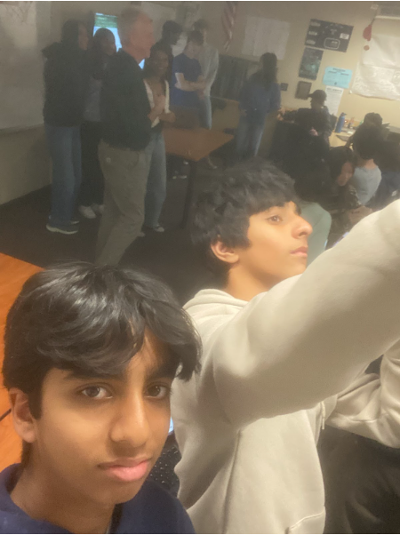

After school today, I attended the College Student Panel with the college students Vivian, Michael, David, and Edwin, hosted by Girls In CS. 

Today, I learned about many things that I need to do and can apply to myself.

First, I learned that I need to apply to myself is the ability to clearly explain my code and how my code works. because being able to communicate on your work is an important skill. To do this, I need to be clear and concise, and know what to go over before presenting. Also, to help, I need to document everything, which will help me show my methodology, since being clear and incorporating agile methodology will help communicate ideas better to others.

Secondly, another thing I can apply is to take suggestions and criticism with an open mind, and think about what suggestions can be implemented and which can not. This is important because it will help improve your code and projects, and having an open mind is crucial since the project and code will never be fully finished.

Thirdly, when thinking about ideas, I learned that when communicating with my group about ideas for a project, we need to gather all the ideas from each person in the group and put it together. As a group, we also need to make sure each person is organized and has a role and not off track. I can apply this idea in class, and also overall when working in a group.

Overall, I learned a lot from this after school College Student Panel hosted by Girls in CS, such as important skills needed in the field of computer science. I can apply all of these skills to this class, which will benefit me in the future.

Here is the selfie of me:

