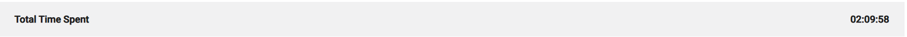
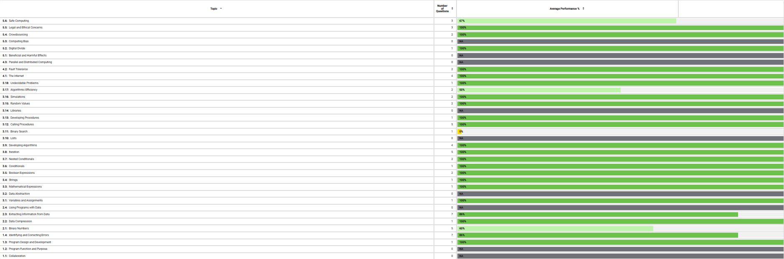
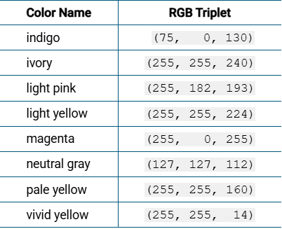
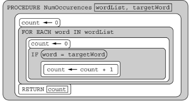

I took the 2020 Practice Exam 1 MCQ in Collegeboard and got a 60/67. Here are all the questions I got wrong:

<h2>Question 11</h2>
<h3>A color in a computing application is represented by an RGB triplet that describes the amount of red, green, and blue, respectively, used to create the desired color. A selection of colors and their corresponding RGB triplets are shown in the following table. Each value is represented in decimal (base 10).</h3>

<h3>According to information in the table, what color is represented by the binary RGB triplet (11111111, 11111111, 11110000) ?</h3>

I chose: D,
Correct Answer: A

I thought (11111111, 11111111, 11110000) was vivid yellow (255, 255, 14), but its correct decimal value is (255, 255, 240), which corresponds to ivory, so ivory is the correct answer.

<h2>Question 12</h2>
<h3>A color in a computing application is represented by an RGB triplet that describes the amount of red, green, and blue, respectively, used to create the desired color. A selection of colors and their corresponding RGB triplets are shown in the following table. Each value is represented in decimal (base 10).</h3>

<h3>What is the binary RGB triplet for the color indigo?</h3>

I chose: A,
Correct Answer: C

I thought that the binary representation of indigo (75, 0, 130) was equal to (00100101, 00000000, 10000010). Instead, C (01001011, 00000000, 10000010) correctly represents indigo.

<h2>Question 26</h2>
<h3>A list of binary values (0 or 1) is used to represent a black-and-white image. Which of the following is LEAST likely to be stored as metadata associated with the image?</h3>

I chose: A,
Correct answer: D

I chose A (Copyright information for the image) because I thought that copyright information was not likely to be stored as metadata for an image, but instead D (A Duplicate copy of the data) is actually not metadata for an image.

<h2>Question 40</h2>
<h3>Which of the following best explains how a certificate authority is used in protecting data?</h3>

I chose: A,
Correct answer: D

I chose A because I thought that a certificate authority would verify the safety of websites, ensuring that user data is protected. But instead D is correct since it verifies encryption key authenticity.

<h2>Question 47</h2>
<h3>The procedure BinarySearch (numList, target) correctly implements a binary search algorithm on the list of numbers numList. The procedure returns an index where target occurs in numList, or -1 if target does not occur in numList.</h3>

<h3>Which of the following conditions must be met in order for the procedure to work as intended?</h3>

I chose: B,
Correct answer: C

I chose B because I thought that a binary search won't work if the list has duplicate values. I should have chosen C because a list must be sorted in order for a binary search to work.

<h2>Question 50</h2>
<h3>Consider the following algorithms. Each algorithm operates on a list containing n elements, where n is a very large integer.</h3>

<h3>I. An algorithm that accesses each element in the list twice</h3>
<h3>II. An algorithm that accesses each element in the list n times</h3>
<h3>III. An algorithm that accesses only the first 10 elements in the list, regardless of the size of the list</h3>
<h3>Which of the algorithms run in reasonable time?</h3>

I chose: B,
Correct Answer: D

I chose B because I only thought that Algorithm III ran in reasonable time. I should have chosen D (I, II, and III) because all the algorithms work in reasonable time since all three are less than the time complexity limit.

<h2>Question 67</h2>
<h3>The procedure NumOccurrences is intended to count and return the number of times targetWord appears in the list wordList. The procedure does not work as intended.</h3>

<h3>For which of the following code segments will the call to NumOccurrences NOT return the intended value? Select two answers.</h3>

I chose: D,
Correct answer: A, B

I chose D because I misread the question. Also, I didn't see that it said to select two answers. I should have chosen A and B because they both have words that appear in the list, but incorrectly return 0.

<h2>Conclusion</h2>

In conclusion, I performed well in programming topics like conditionals, boolean expressions, iteration, and program design and development. However, I need to improve in binary numbers, binary search, and time complexity. This MCQ made me realize I need to work on computer science theory such as binary and time complexity, so I will review these topics using Collegeboard and online resources.

