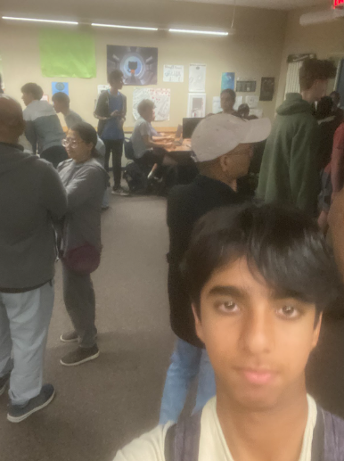
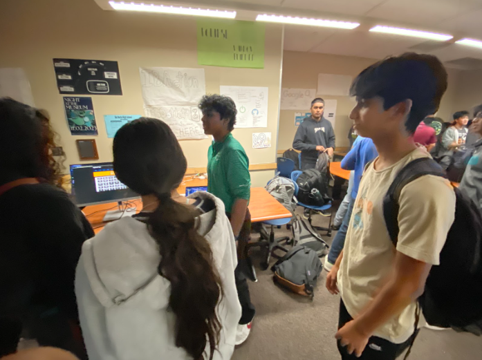
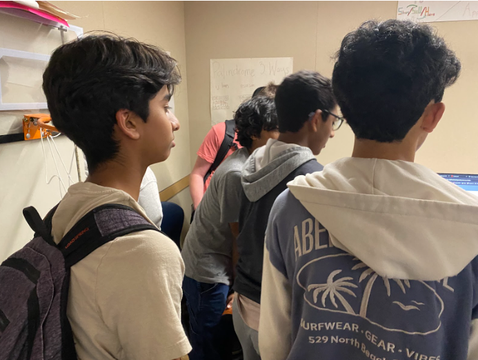
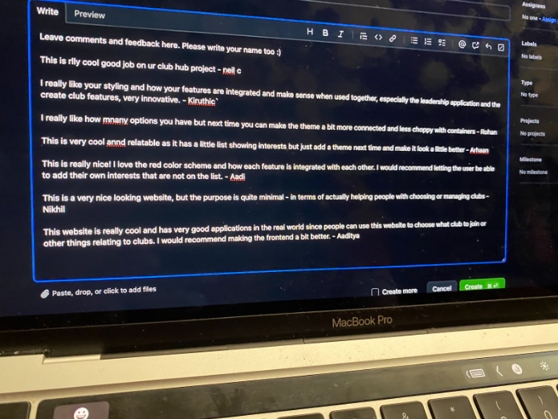

<h3>Striverr</h3>

At N@TM, I explored Striverr, a project with features like Hobbies, a Step Tracker, and Quotes to encourage personal growth. I suggested improving the styling and adding distinct functions for admins and users for better security.

<h3>Club Hub</h3>

I also visited Club Hub, a site designed to help students find extracurricular clubs. I liked its real-world application and recommended improving the frontend for a better user experience.

Here are the pictures of me at N@TM:
 
 

<h3>Own Project/Feature</h3>

I was able to present my feature at N@TM to many people, describing how Packing Portal gives packing recommendations to users for their trip and demoing the functionality.
 
 

Through a google form, our entire group got feedback on our presentation and website. Here are the results:
 
 

- 4.42 - How unique was our project?
 
- 3.92 - How attractive was our website design?
 
- 4.42 - How easy was it to follow along to our presentation?
 
- 4.67 - How well did we serve the purpose of simplified traveling?
 
 
One specific piece of feedback I got was:
 
 
"You should be able to add your own packing items instead of only being able to select items that are given."
 
 
In order to improve, I can follow this feedback and add this functionality to my feature. In relation to the project, my strengths have been implementing APIs and backend to frontend connections because I have implemented a Weather API, a personal API with CRUD operations, and admin functionality. I realized that my weakness is planning and documentation because I have not been document my progress through issues during the project, which I can improve on.
 
 
This project has allowed me to reflect on my own strengths and weaknesses. I realized I am good at the programming, such as backend, frontend, and backend to frontend connection. I realized that I can improve on my planning and ideation because I usually tend to rush on that stage.
 
 
Overall, my next steps in Computer Science will be to take more classes, like AP CSA. Also, in my future, I want to pursue computer science in college and as my career.
 
