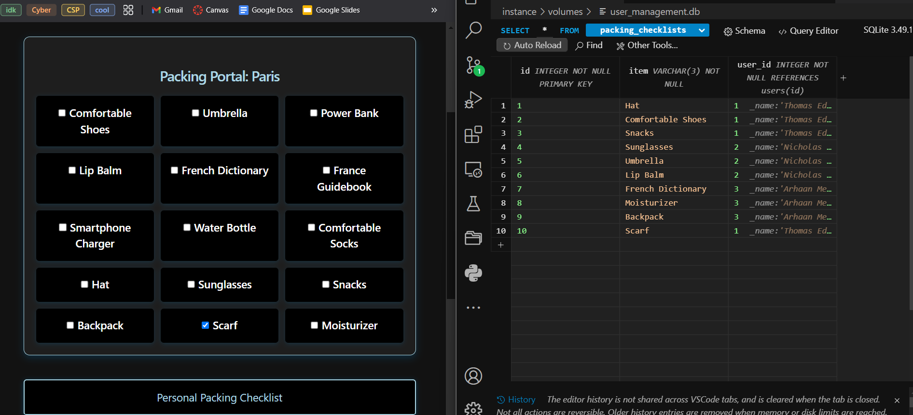
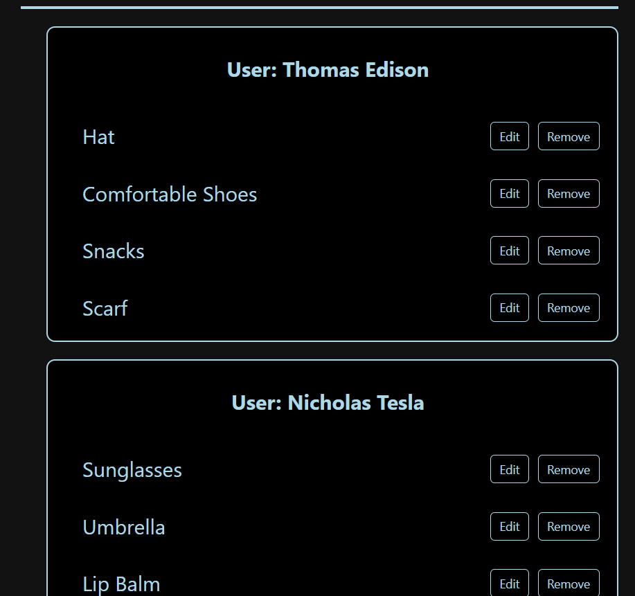
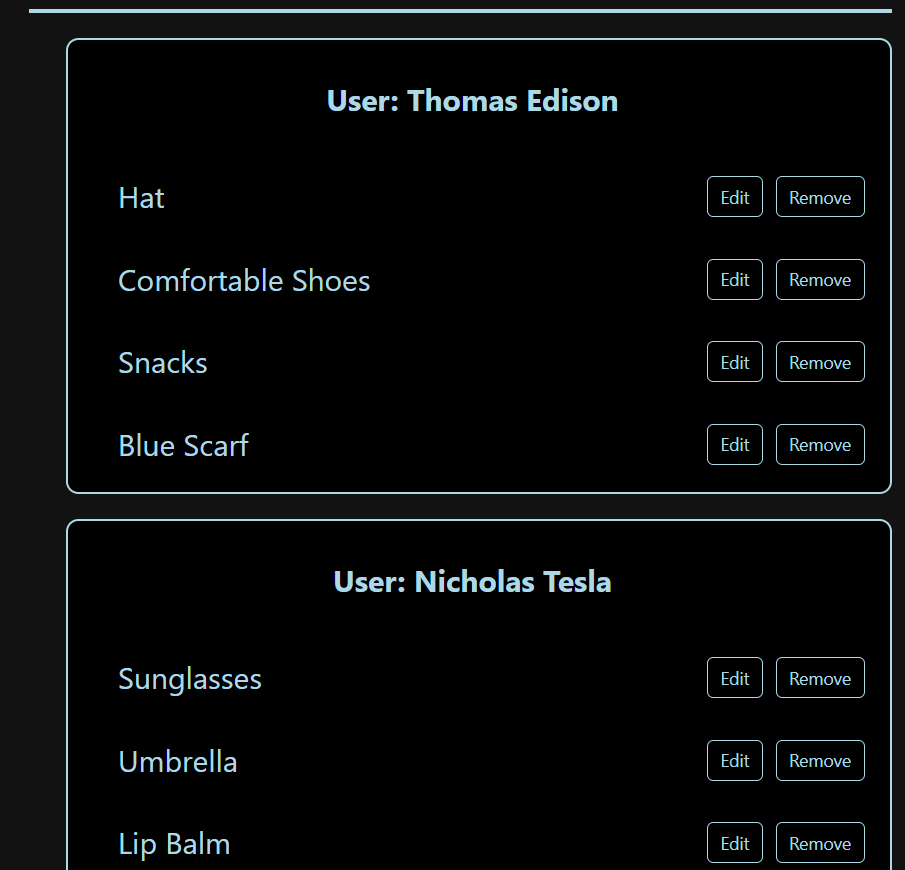
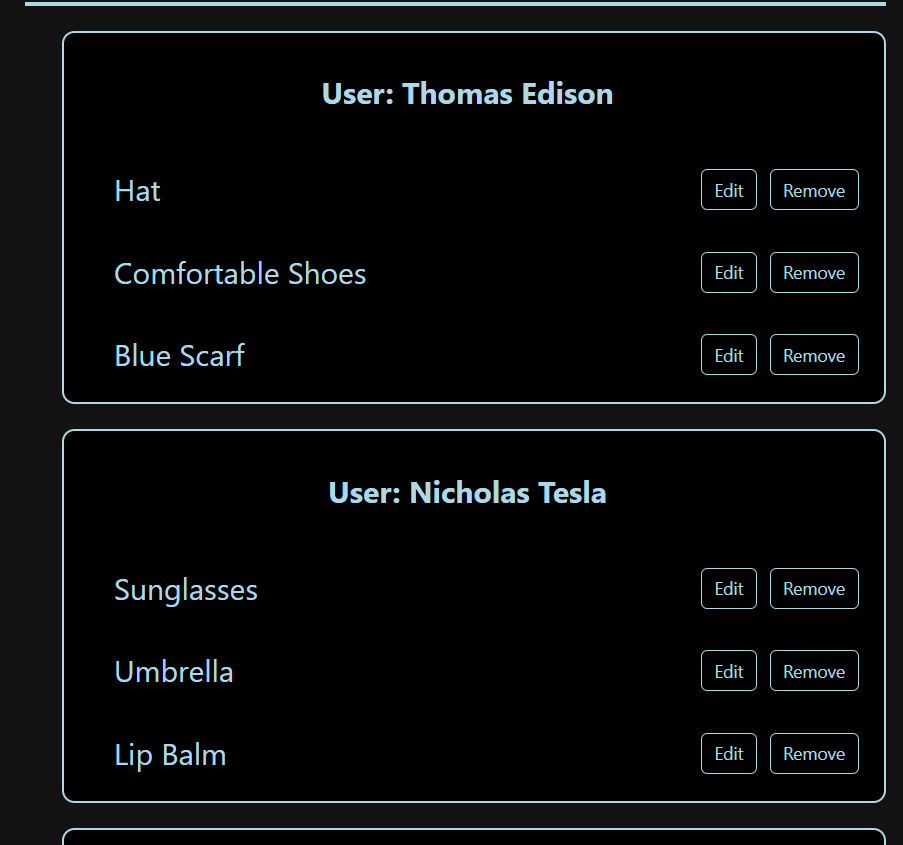

<h2>Purpose</h2>
In this blog, I will explain how Collegeboard's CPT requirements are implemented in my code, and how it has guided me when coding my feature, Packing Portal.

<h2>User Input Handling:</h2>


<h3>Checkbox Click</h3>

Here, when a checkbox is clicked, it calls the postPackingChecklists function with the string.

```
<div class="packing-item">
    <input type="checkbox" id="packing-item-1" onclick="handleCheckboxClick(this, 'Comfortable Shoes')">
    <label for="packing-item-1">Comfortable Shoes</label><br>
</div>

<div class="packing-item">
    <input type="checkbox" id="packing-item-2" onclick="handleCheckboxClick(this, 'Umbrella')">
    <label for="packing-item-2">Umbrella</label><br>
</div>

window.handleCheckboxClick = async function handleCheckboxClick(checkbox, itemText) {
    await postPackingChecklist(itemText);
};
```

<h3>Posting Packing Items</h3>

My POST function will post the packing items to the database:

```
async function postPackingChecklist(itemText) {
    const postData = {
        item: itemText
    };
    try {
        const response = await fetch(`${pythonURI}/api/packing_checklists`, {
            ...fetchOptions,
            method: 'POST',
            headers: {
                'Content-Type': 'application/json'
            },
            body: JSON.stringify(postData),
        });
        if (!response.ok) {
            throw new Error('Failed to add item: ' + response.statusText);
        }
        const data = await response.json();
        console.log('Item added:', data);
        return data;
    } catch (error) {
        console.error('Error adding item:', error);
        alert('Error adding item: ' + error.message);
    }
}
```

<h3>Displaying Packing Items</h3>

My GET request gets the packing data from the database, and then it is put into objects that are added to the DOM to be displayed:

```
async function getPackingChecklists() {
    try {
        const response = await fetch(`${pythonURI}/api/packing_checklists`, {
            ...fetchOptions,
            method: 'GET',
        });
        if (!response.ok) {
            throw new Error('Failed to fetch packing checklists: ' + response.statusText);
        }
        const data = await response.json();
        console.log('Packing checklists get:', data);
        const checklistArea = document.getElementById('checklist_area');
        checklistArea.innerHTML = '';

        let currentUser = data.length > 0 ? data[0].current_user : null;
        let isAdmin = data.length > 0 ? data[0].is_admin : false;

        // Filter items based on user role

        const filteredData = isAdmin ? data : data.filter(item => item.user_id === currentUser);
        // Group items by user

        const groupedItems = {};
        filteredData.forEach(item => {
            if (!groupedItems[item.user_id]) {
                groupedItems[item.user_id] = {
                    user_name: item.user_name || `User ${item.user_id}`, // Ensure we display something
                    items: []
                };
            }
            groupedItems[item.user_id].items.push(item);
        });
        // Create sections for each user

        Object.values(groupedItems).forEach(userGroup => {
            // Create a section container

            const userSection = document.createElement('div');
            userSection.className = 'user-section';
            // Create a section header with the user's name

            const userHeader = document.createElement('h3');
            userHeader.textContent = `User: ${userGroup.user_name.replace(/^User\s+/i, '')}`;
            userHeader.className = 'user-section-header';
            userSection.appendChild(userHeader);
            // Create a list for the user's items
            const userList = document.createElement('ul');
            userList.className = 'user-checklist';
            userGroup.items.forEach(item => {

                const listItem = document.createElement('li');
                listItem.className = 'checklist-item';
                const nameSpan = document.createElement('span');
                nameSpan.textContent = item.item;
                // Create a container for buttons
                const buttonContainer = document.createElement('div');
                buttonContainer.className = 'button-container';
                const editButton = document.createElement('button');
                editButton.className = 'edit-button';
                editButton.textContent = 'Edit';
                editButton.addEventListener('click', () => {
                    enableEditing(item, listItem, nameSpan, editButton);
                });

                const removeButton = document.createElement('button');
                removeButton.className = 'remove-button';
                removeButton.textContent = 'Remove';
                removeButton.addEventListener('click', () => {
                    deletePackingChecklist(item.id);
                    listItem.remove();
                });

                // Append buttons to the button container
                buttonContainer.appendChild(editButton);
                buttonContainer.appendChild(removeButton);
                // Append everything to the checklist item
                listItem.appendChild(nameSpan);
                listItem.appendChild(buttonContainer);
                userList.appendChild(listItem);
            });

            userSection.appendChild(userList);
            checklistArea.appendChild(userSection);
        });

    } catch (error) {
        console.error('Error fetching packing checklists:', error);
        alert('Error fetching packing checklists: ' + error.message);
    }
};
```

<h3>Initialize, Backup, and Restore</h3>

Here is my initialize function which adds tester data to the database:

```
def initPackingChecklist():

    with app.app_context():

        db.create_all()

        test_data = [
            Weather(item="Hat", user_id=1),
            Weather(item="Comfortable Shoes", user_id=1),
            Weather(item="Snacks", user_id=1),
            Weather(item="Sunglasses", user_id=2),
            Weather(item="Umbrella", user_id=2),
            Weather(item="Lip Balm", user_id=2),
            Weather(item="French Dictionary", user_id=3),
            Weather(item="Moisturizer", user_id=3),
            Weather(item="Backpack", user_id=3),
        ]
        
        for data in test_data:
            try:
                db.session.add(data)
                db.session.commit()
                print(f"Record created: {repr(data)}")
            except Exception as e:
                db.session.rollback()
                print(f"Error creating record for user {data.user_id}: {e}")
```

If I want to backup or restore:

```
./scripts/db_backup.py
```
```
./scripts/db_restore.py
```


<h2>List or Collection Usage</h2>


<h3>Lists</h3>

Here is my GET function in the backend, which returns a list of the packing item and user when queried:

```
@token_required()
@cross_origin(supports_credentials=True)
def get(self):
    
    weather_id = request.args.get('id')

    if weather_id:
        weather = Weather.query.get(weather_id)
        
        if not weather:
            return {'message': 'Weather not found'}, 404
        return jsonify(weather)
    
    current_user = g.current_user
    is_admin = current_user.role == 'Admin'
    
    all_items = db.session.query(Weather, User).join(User, Weather.user_id == User.id).all()
    item_list = [{"id": item.Weather.id, "user_id": item.User._name, "current_user": current_user._name, "is_admin": is_admin, "item": item.Weather.item} for item in all_items]
    
    
    return jsonify(item_list)
```


<h3>Lists and Dictionaries (CRUD)</h3>

Here are my CRUD operations in the backend, where dictionaries and lists are used:

```
def create(self):

    try:
        db.session.add(self)
        db.session.commit()
    except Exception as e:
        db.session.rollback()
        raise e
    return self

def read(self):

    return {
        "id": self.id,
        "item": self.item,
        "user_id": self.user_id
        
    }
    
def update(self, data):

    self.item = data.get('item', self.item)
    self.user = data.get('user_id', self.user_id)
    try:
        db.session.commit()
    except Exception as e:
        db.session.rollback()
        raise e
    
def delete(self):

    try:
        db.session.delete(self)
        db.session.commit()
    except Exception as e:
        db.session.rollback()
        raise e
    
@staticmethod
def restore(data):
    for packing_item in data:
        packing_id = packing_item.pop('id', None)  # Remove 'id' from post_data
        if packing_id is not None:
            item = Weather.query.get(packing_id)
            if item:
                item.update(packing_item)
            else:
                item = Weather(**packing_item)
                item.create()
        else:
            item = Weather(**packing_item)
            item.create()
```

Based on my code, the usage of lists and other collection types are clear.


<h2>Student-Developed Procedure:</h2>

One part of my feature was a weather api, which would get real-time weather data for a certain city:

```
def get(self):
            
    # retrieve the weather data for the latitude and longitude of a city
    
    lat = request.args.get('lat', '')  # get the latitude of the city from the query parameters
    lon = request.args.get('lon', '')  # get the longitude of the city from the query parameters
    weather_data = get_weather_data(lat, lon)

    if weather_data:
        return jsonify(weather_data)
    else:
        return jsonify({"error": "Failed to get weather data"}), 500

# add the resource for /weather

api.add_resource(_Weather, '/weather')

def get_weather_data(lat, lon):
    
    # get the weather data for the latitude and longitude of a city

    api_url = weather_api_url.format(lat, lon)
    response = requests.get(api_url, headers={'X-Api-Key': api_key})
    
    if response.status_code == requests.codes.ok:
        return response.json()
    else:
        print("Error:", response.status_code, response.text)
        return None
```
```
async function fetchWeatherData() {

    try {

        // fetch weather data for Paris using its latitude and longitude
        const response = await fetch(`${pythonURI}/api/weather?lat=48.8566&lon=2.3522`);


        // check if response is ok
        if (!response.ok) {
            throw new Error(`HTTP error! status: ${response.status}`);
        }

        // convert the response to JSON
        const weatherData = await response.json();

        // displaying the weather info

        displayWeatherInfo(weatherData);
    } catch (error) {
        console.error('Error fetching weather data:', error);
    }
};
```

In addition, through my CRUD operations, I added a feature to save packing items, where users can see the items in a personal checklist. It also contains admin functionality, allowing users to see their own list, while admins can see all lists:

```
async function getPackingChecklists() {
    try {
        const response = await fetch(`${pythonURI}/api/packing_checklists`, {
            ...fetchOptions,
            method: 'GET',

        });

        if (!response.ok) {
            throw new Error('Failed to fetch packing checklists: ' + response.statusText);
        }

        const data = await response.json();
        console.log('Packing checklists get:', data);

        const checklistArea = document.getElementById('checklist_area');

        checklistArea.innerHTML = '';

        let currentUser = data.length > 0 ? data[0].current_user : null;
        let isAdmin = data.length > 0 ? data[0].is_admin : false;

        console.log("Current user:", currentUser);
        console.log("Is admin:", isAdmin);


        // Filter items based on user role
        const filteredData = isAdmin ? data : data.filter(item => item.user_id === currentUser);

        // Group items by user
        const groupedItems = {};
        filteredData.forEach(item => {
            if (!groupedItems[item.user_id]) {
                groupedItems[item.user_id] = {
                    user_name: item.user_name || `User ${item.user_id}`, // Ensure we display something
                    items: []
                };
            }
            groupedItems[item.user_id].items.push(item);
        });

        // Create sections for each user
        Object.values(groupedItems).forEach(userGroup => {
            // Create a section container
            const userSection = document.createElement('div');
            userSection.className = 'user-section';

            // Create a section header with the user's name
            const userHeader = document.createElement('h3');
            userHeader.textContent = `User: ${userGroup.user_name.replace(/^User\s+/i, '')}`;
            userHeader.className = 'user-section-header';

            userSection.appendChild(userHeader);

            // Create a list for the user's items
            const userList = document.createElement('ul');
            userList.className = 'user-checklist';

            userGroup.items.forEach(item => {
                const listItem = document.createElement('li');
                listItem.className = 'checklist-item';

                const nameSpan = document.createElement('span');
                nameSpan.textContent = item.item;

                // Create a container for buttons
                const buttonContainer = document.createElement('div');
                buttonContainer.className = 'button-container';

                const editButton = document.createElement('button');
                editButton.className = 'edit-button';
                editButton.textContent = 'Edit';
                editButton.addEventListener('click', () => {
                    enableEditing(item, listItem, nameSpan, editButton);
                });

                const removeButton = document.createElement('button');
                removeButton.className = 'remove-button';
                removeButton.textContent = 'Remove';
                removeButton.addEventListener('click', () => {
                    deletePackingChecklist(item.id);
                    listItem.remove();
                });

                // Append buttons to the button container
                buttonContainer.appendChild(editButton);
                buttonContainer.appendChild(removeButton);

                // Append everything to the checklist item
                listItem.appendChild(nameSpan);
                listItem.appendChild(buttonContainer);
                userList.appendChild(listItem);
            });


            userSection.appendChild(userList);
            checklistArea.appendChild(userSection);
        });

    } catch (error) {
        console.error('Error fetching packing checklists:', error);
        alert('Error fetching packing checklists: ' + error.message);
    }
};
```


<h3>Must have a defined name and return type</h3>

The ```get()```, ```post()```, ```put()```, and ```delete()``` functions will update the database, and will either return a success message or an error.

<h3>Must use at least one parameter that affects functionality</h3>

My ```fetchWeatherData()``` function fetches the weather data based on the longitude and latitude of a city. The outputs will be different based on the city. In addition, the packing items that are posted to the database will be different based on the items selected.


<h2>Algorithm Implementation:</h2>


<h3>Sequencing</h3>

- The user POSTs a packing item, GETs the packing items in their list, edits (PUT) a packing item from the list, or DELETEs a packing item.
<br>
- From the frontend, the request is sent to the backend
<br>
- Based on the type of request, the backend will perform the task
<br>
- The backend returns a response back to the frontend.
<br>
- The frontend receives the response and updates the frontend dynamically.


<h3>Selection</h3>

I used selection in my POST function to check if all the data is present when posting to the database:

```
if not data or 'item' not in data:
    return {'message': 'Required information not entered'}, 400
```

<h3>Iteration</h3>

For each user that selected an item, I loop through each item they selected and display it:

```
userGroup.items.forEach(item => {
    const listItem = document.createElement('li');
    listItem.className = 'checklist-item';

    const nameSpan = document.createElement('span');
    nameSpan.textContent = item.item;

    // Create a container for buttons
    const buttonContainer = document.createElement('div');
    buttonContainer.className = 'button-container';

    const editButton = document.createElement('button');
    editButton.className = 'edit-button';
    editButton.textContent = 'Edit';
    editButton.addEventListener('click', () => {
        enableEditing(item, listItem, nameSpan, editButton);
    });

    const removeButton = document.createElement('button');
    removeButton.className = 'remove-button';
    removeButton.textContent = 'Remove';
    removeButton.addEventListener('click', () => {
        deletePackingChecklist(item.id);
        listItem.remove();
    });

    // Append buttons to the button container
    buttonContainer.appendChild(editButton);
    buttonContainer.appendChild(removeButton);

    // Append everything to the checklist item
    listItem.appendChild(nameSpan);
    listItem.appendChild(buttonContainer);
    userList.appendChild(listItem);
});
```


<h2>Program Output:</h2>

Here are the different visual outputs:







<h2>Commenting and Acknowledgment:</h2>

Comments are present in my code to explain how it works and what each part does.

