<h3>Description: Packing Portal</h3>
Packing Portal offers packing recommendations based on the user's trip. It suggests items to pack, provides a customizable checklist, and includes destination weather updates to guide users on items to pack. Users can edit, delete, or review their checklist anytime, while admins can access all checklists.

<h3>Big Idea 1.4: Debugging Code and Fixing Errors</h3>
Big Idea 1.4 was utilized in my feature because I spent a lot of time debugging the frontend, backend, and testing the data flow between frontend and backend.

Here, I spent time testing the CRUD operations from the backend through Postman:

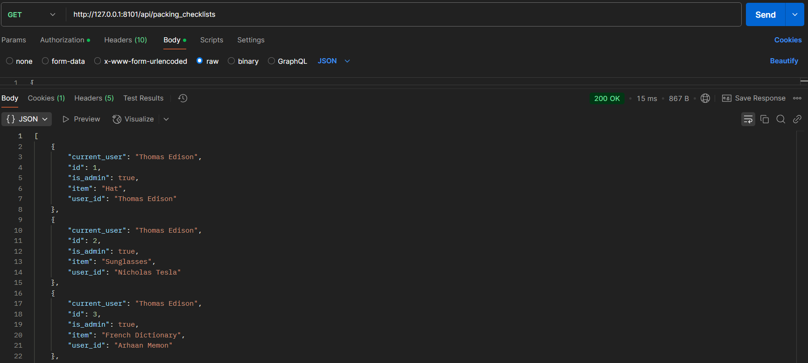

Here, I use the console to debug errors and look at successful responses:

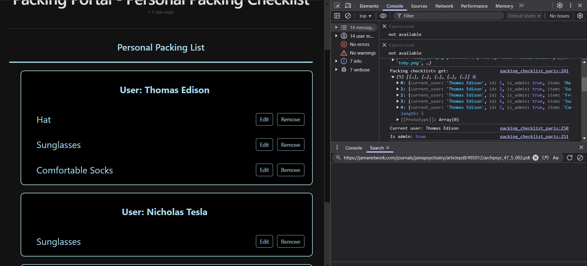

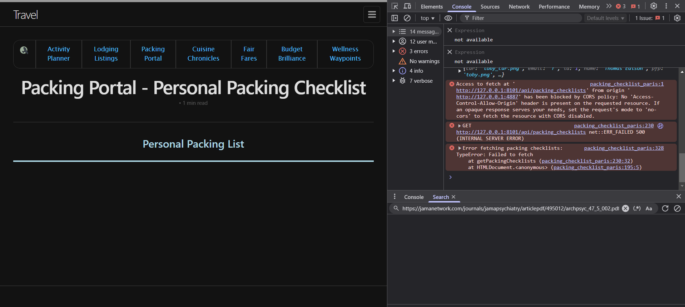

Here, you can see that when I add a new item, it sends a POST request from the frontend and adds the data in the backend. When I go into the personal packing checklist, the frontend sends a GET request and displays the information from the backend.

<video width="722.4" height="324.45" controls>
    <source src="../images/frontend_to_backend.mp4" type="video/mp4">
    Your browser does not support the video tag.
</video>

Here, I have tester data in my ```initPackingChecklist():``` to test the functionality of my feature and my API.

```
def initPackingChecklist():

    with app.app_context():

        db.create_all()

        test_data = [
            Weather(item="Hat", user_id=1),
            Weather(item="Comfortable Shoes", user_id=1),
            Weather(item="Snacks", user_id=1),
            Weather(item="Sunglasses", user_id=2),
            Weather(item="Umbrella", user_id=2),
            Weather(item="Lip Balm", user_id=2),
            Weather(item="French Dictionary", user_id=3),
            Weather(item="Moisturizer", user_id=3),
            Weather(item="Backpack", user_id=3),
        ]
        
        for data in test_data:
            try:
                db.session.add(data)
                db.session.commit()
                print(f"Record created: {repr(data)}")
            except Exception as e:
                db.session.rollback()
                print(f"Error creating record for user {data.user_id}: {e}")
```

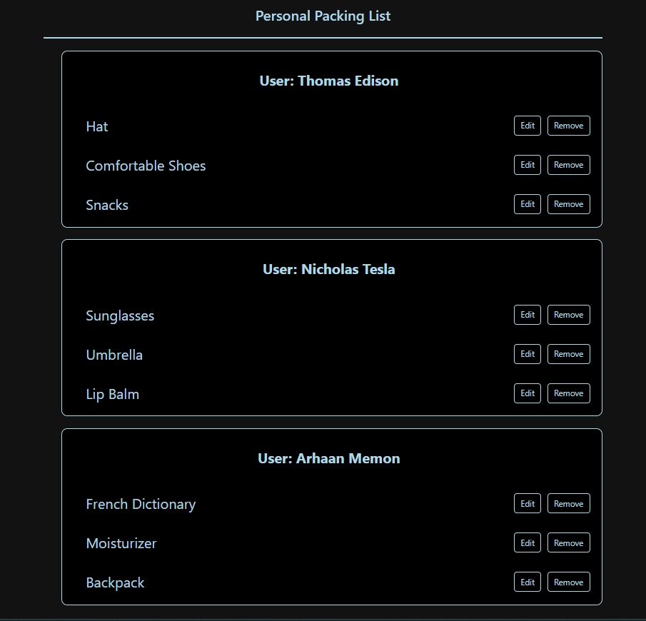


<h3>Big Idea 2: Data</h3>

My feature heavily incorporated Big Idea 2 because I stored the user packing information in the database.

Here, all user data is stored, including their name, uid, password, role, and pfp.

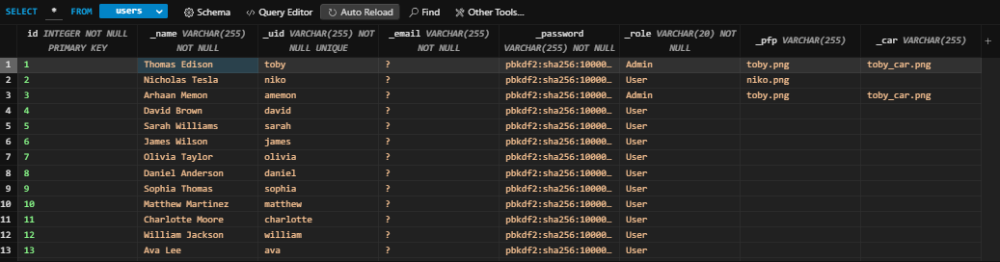

Here is my backend code to retrieve the data from the backend, along with getting the role of the user, which will help is data security and privacy.

```
@token_required()
@cross_origin(supports_credentials=True)
def get(self):
    
    weather_id = request.args.get('id')

    if weather_id:
        weather = Weather.query.get(weather_id)
        
        if not weather:
            return {'message': 'Weather not found'}, 404
        return jsonify(weather)
    
    current_user = g.current_user
    is_admin = current_user.role == 'Admin'
    
    all_items = db.session.query(Weather, User).join(User, Weather.user_id == User.id).all()
    item_list = [{"id": item.Weather.id, "user_id": item.User._name, "current_user": current_user._name, "is_admin": is_admin, "item": item.Weather.item} for item in all_items]
    
    
    return jsonify(item_list)
```

Here is my frontend code to display the items on the frontend, along with the code which displays only displays the user's own list if they are a normal user, which increases security and privacy.

```
async function getPackingChecklists() {
    try {
        const response = await fetch(`${pythonURI}/api/packing_checklists`, {
            ...fetchOptions,
            method: 'GET',
        });
        if (!response.ok) {
            throw new Error('Failed to fetch packing checklists: ' + response.statusText);
        }
        const data = await response.json();
        console.log('Packing checklists get:', data);
        const checklistArea = document.getElementById('checklist_area');
        checklistArea.innerHTML = '';
        let currentUser = data.length > 0 ? data[0].current_user : null;
        let isAdmin = data.length > 0 ? data[0].is_admin : false;
        console.log("Current user:", currentUser);
        console.log("Is admin:", isAdmin);

        // Filter items based on user role
        const filteredData = isAdmin ? data : data.filter(item => item.user_id === currentUser);

        // Group items by user
        const groupedItems = {};
        filteredData.forEach(item => {
            if (!groupedItems[item.user_id]) {
                groupedItems[item.user_id] = {
                    user_name: item.user_name || `User ${item.user_id}`, // Ensure we display something
                    items: []
                };
            }
            groupedItems[item.user_id].items.push(item);
        });
        // Create sections for each user
        Object.values(groupedItems).forEach(userGroup => {
            // Create a section container
            const userSection = document.createElement('div');
            userSection.className = 'user-section';
            // Create a section header with the user's name
            const userHeader = document.createElement('h3');
            userHeader.textContent = `User: ${userGroup.user_name.replace(/^User\s+/i, '')}`;
            userHeader.className = 'user-section-header';
            userSection.appendChild(userHeader);
            // Create a list for the user's items
            const userList = document.createElement('ul');
            userList.className = 'user-checklist';
            userGroup.items.forEach(item => {
                const listItem = document.createElement('li');
                listItem.className = 'checklist-item';
                const nameSpan = document.createElement('span');
                nameSpan.textContent = item.item;
                // Create a container for buttons
                const buttonContainer = document.createElement('div');
                buttonContainer.className = 'button-container';
                const editButton = document.createElement('button');
                editButton.className = 'edit-button';
                editButton.textContent = 'Edit';
                editButton.addEventListener('click', () => {
                    enableEditing(item, listItem, nameSpan, editButton);
                });
                const removeButton = document.createElement('button');
                removeButton.className = 'remove-button';
                removeButton.textContent = 'Remove';
                removeButton.addEventListener('click', () => {
                    deletePackingChecklist(item.id);
                    listItem.remove();
                });
                // Append buttons to the button container
                buttonContainer.appendChild(editButton);
                buttonContainer.appendChild(removeButton);
                // Append everything to the checklist item
                listItem.appendChild(nameSpan);
                listItem.appendChild(buttonContainer);
                userList.appendChild(listItem);
            });
            userSection.appendChild(userList);
            checklistArea.appendChild(userSection);
        });
    } catch (error) {
        console.error('Error fetching packing checklists:', error);
        alert('Error fetching packing checklists: ' + error.message);
    }
};
```

In order to backup and restore data in the database to prevent data loss, we run:

```
./scripts/db_backup.py
```
```
./scripts/db_restore.py
```


<h3>Big Idea 4: Internet</h3>

My project used Big Idea 4 to deploy our website on the internet so anyone can access it at any time.

We used AWS to deploy our project onto the internet. In addition, DNS is used to map the URL to the IP address because it is hard to remember the IP addresses of many websites. For our deployed website, it mapped ```intertravel.stu.nighthawkcodingsociety.com``` to ```3.129.109.200```.

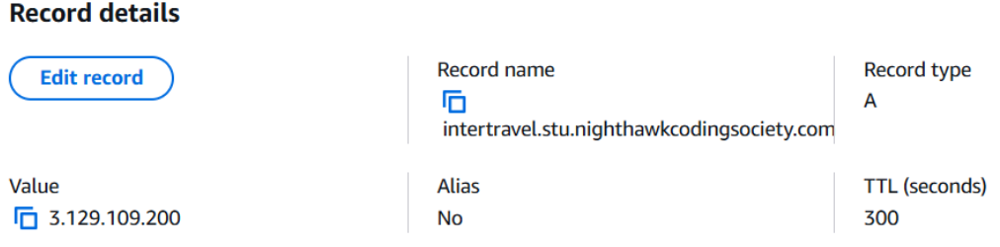

Here are my POST, PUT, and DELETE methods in the backend (I already showed GET):

```
@token_required()
@cross_origin(supports_credentials=True)
def post(self):

    current_user = g.current_user
    data = request.get_json()
    item = data.get('item')
    
    if not data or 'item' not in data:
        return {'message': 'Required information not entered'}, 400

    current_user = g.current_user

    weather = Weather(
        item=data.get('item'), 
        user_id=current_user.id
    )
    
    db.session.add(weather)
    db.session.commit()
    return jsonify(weather.read())

def put(self):
    data = request.get_json()

    if not data or 'id' not in data:
        return {'message': 'ID is required for updating information'}, 400

    weather = Weather.query.get(data['id'])
    if not weather:
        return {'message': 'Information not found'}, 404

    try:
        weather.update(data)
        return jsonify(weather.read())
    except Exception as e:
        return {'message': f'Error updating information: {e}'}, 500


def delete(self):

    data = request.get_json()

    if not data or 'id' not in data:
        return {'message': 'ID is required for deleting information'}, 400

    weather = Weather.query.get(data['id'])
    if not weather:
        return {'message': 'Information not found'}, 404

    try:
        weather.delete()
        return {'message': 'Information deleted successfully'}, 200
    except Exception as e:
        return {'message': f'Error deleting information: {e}'}, 500
```

And, here are my POST, PUT, and DELETE methods in the frontend which interact with the backend (I already showed GET):

```
async function postPackingChecklist(itemText) {
    const postData = {
        item: itemText
    };
    try {
        const response = await fetch(`${pythonURI}/api/packing_checklists`, {
            ...fetchOptions,
            method: 'POST',
            headers: {
                'Content-Type': 'application/json'
            },
            body: JSON.stringify(postData),
        });

        if (!response.ok) {
            throw new Error('Failed to add item: ' + response.statusText);
        }
        const data = await response.json();
        console.log('Item added:', data);
        return data;
    } catch (error) {
        console.error('Error adding item:', error);
        alert('Error adding item: ' + error.message);
    }
}

async function deletePackingChecklist(id) {
    const deleteData = {
        id: id,
    }
    try {
        const response = await fetch(`${pythonURI}/api/packing_checklists`, {
            method: 'DELETE',
            headers: {
                'Content-Type': 'application/json'
            },
            body: JSON.stringify(deleteData)
        });
        if (!response.ok) {
            throw new Error('Failed to delete item: ' + response.statusText);
        }
        const data = await response.json();
    } catch (error) {
        console.error('Error deleting item:', error);
        alert('Error deleting item:' + error.message);
    }
}


async function putPackingChecklist(id, new_name) { 
    const putData = {
        id: id,
        item: new_name
    }
    try {
        const response = await fetch(`${pythonURI}/api/packing_checklists`, {
            method: 'PUT',
            headers: {
                'Content-Type': 'application/json'
            },
            body: JSON.stringify(putData)
        });
        if(!response.ok) {
            throw new Error('Failed to update item: ' + response.statusText);
        }
        const data = await response.json();
        console.log('Item updated:', data);
    } catch (error) {
        console.error('Error updating item:', error);
        alert('Error updating item: ' + error.message);
    }
}
```

As you can see, communication between frontend and backend still work on the deployed website:

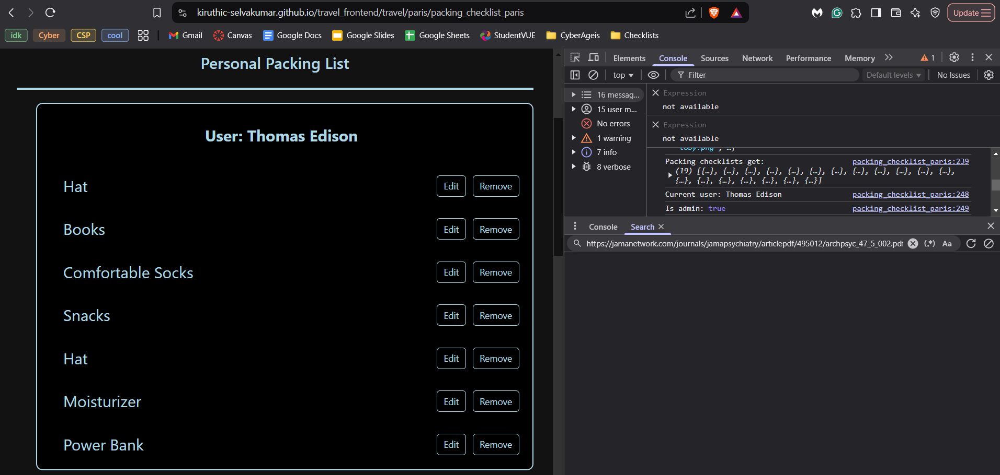
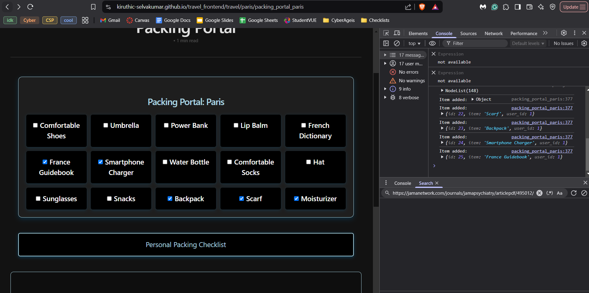
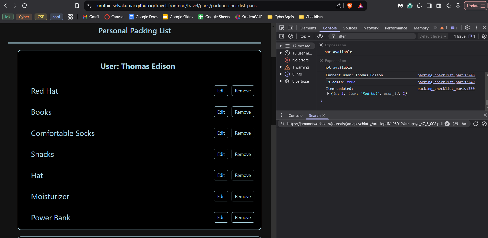
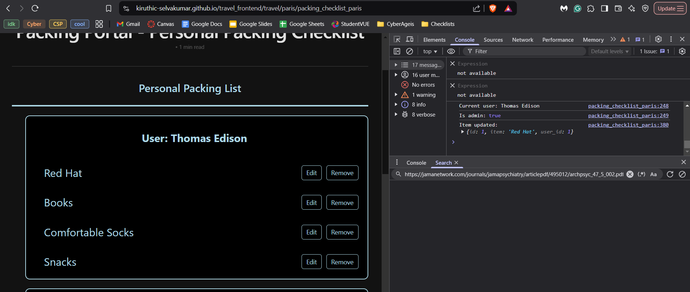


In order to monitor and log application performance and errors, I have conditionals in my backend code which return errors if certain conditions are not met. I can use these errors to debug my code and ensure it is functional. Here is how I monitor and log for:


POST:
```
if not data or 'item' not in data:
    return {'message': 'Required information not entered'}, 400
```
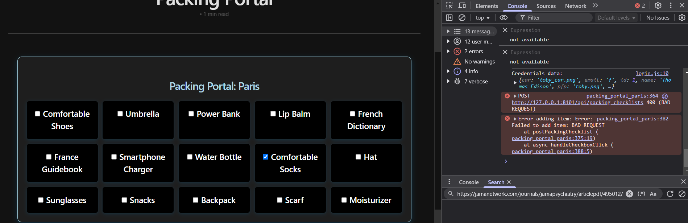

PUT:
```
if not data or 'id' not in data:
    return {'message': 'ID is required for updating information'}, 400
if not weather:
    return {'message': 'Information not found'}, 404
```
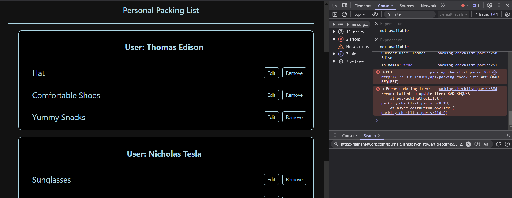

DELETE:
```
if not data or 'id' not in data:
    return {'message': 'ID is required for deleting information'}, 400
if not weather:
    return {'message': 'Information not found'}, 404
```
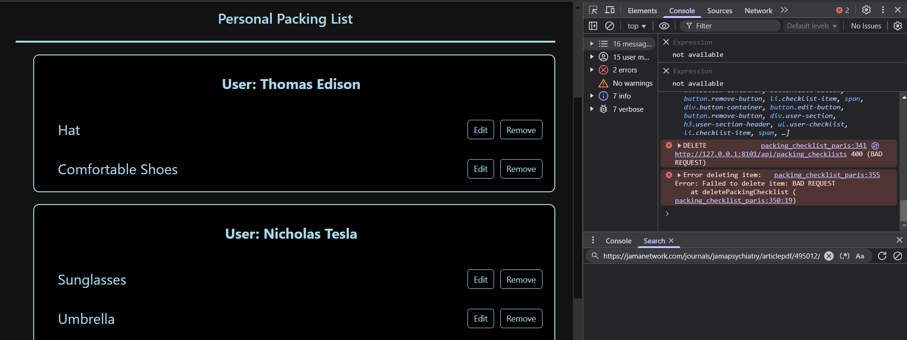


<h3>Conclusion</h3>

Overall, Big Idea 1, Big Idea 2, and Big Idea 4 played a big role in my feature 


