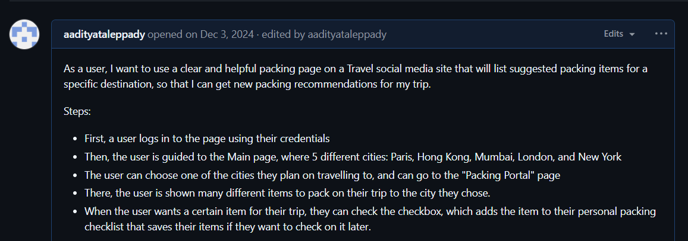
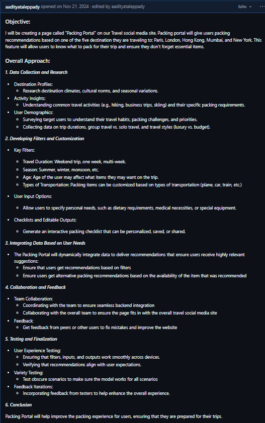
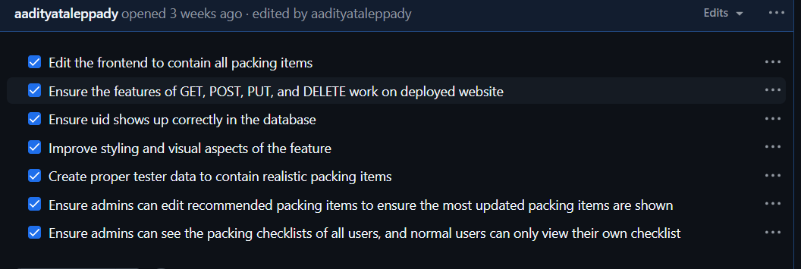
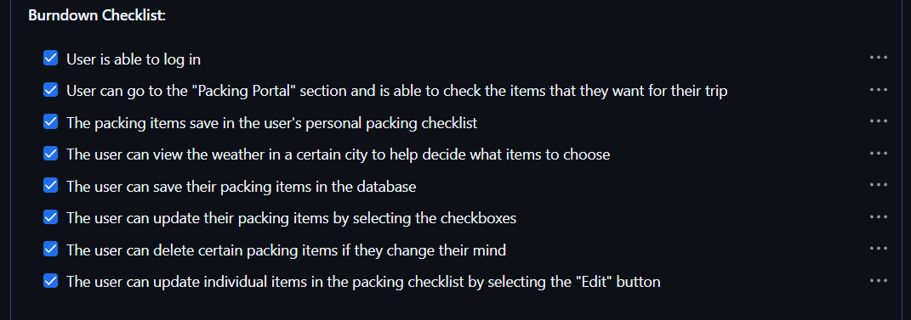

<h2>5 Things In The Past 12 Weeks</h2>

<h3>1. Issues</h3>

I used issues to plan and set goals for the project. Writing issues has helped me stay organized and ensure I meet the requirements.




Here is the link to my issue: <a href="https://github.com/aadityataleppady/aaditya_2025/issues/6#issue-2682066304">Plan for Sprint 4</a>

<h3>2. Burndown List</h3>

I also used burndown lists with requirements to complete for my feature, ensuring I am on task and meeting requirements.




Here is the link to the Kanban board with my burndown lists: <a href="https://github.com/users/Kiruthic-Selvakumar/projects/2/views/1">Kanban Board</a>

<h3>3. Implementing An API</h3>

Here are my GET, POST, PUT, and DELETE functions in my API, which ensure that I can performs these functions on the website.

```
@token_required()
@cross_origin(supports_credentials=True)
def get(self):
    
    weather_id = request.args.get('id')

    if weather_id:
        weather = Weather.query.get(weather_id)
        
        if not weather:
            return {'message': 'Weather not found'}, 404
        return jsonify(weather)
    
    current_user = g.current_user
    is_admin = current_user.role == 'Admin'
    
    all_items = db.session.query(Weather, User).join(User, Weather.user_id == User.id).all()
    item_list = [{"id": item.Weather.id, "user_id": item.User._name, "current_user": current_user._name, "is_admin": is_admin, "item": item.Weather.item} for item in all_items]
    
    
    return jsonify(item_list)
```

```
@token_required()
@cross_origin(supports_credentials=True)
def post(self):

    current_user = g.current_user
    data = request.get_json()
    item = data.get('item')
    
    if not data or 'item' not in data:
        return {'message': 'Required information not entered'}, 400

    current_user = g.current_user

    weather = Weather(
        item=data.get('item'), 
        user_id=current_user.id
    )
    
    db.session.add(weather)
    db.session.commit()
    return jsonify(weather.read())
```

```
def put(self):
    data = request.get_json()

    if not data or 'id' not in data:
        return {'message': 'ID is required for updating information'}, 400

    weather = Weather.query.get(data['id'])
    if not weather:
        return {'message': 'Information not found'}, 404

    try:
        weather.update(data)
        return jsonify(weather.read())
    except Exception as e:
        return {'message': f'Error updating information: {e}'}, 500
```

```
def delete(self):

    data = request.get_json()

    if not data or 'id' not in data:
        return {'message': 'ID is required for deleting information'}, 400

    weather = Weather.query.get(data['id'])
    if not weather:
        return {'message': 'Information not found'}, 404

    try:
        weather.delete()
        return {'message': 'Information deleted successfully'}, 200
    except Exception as e:
        return {'message': f'Error deleting information: {e}'}, 500
```

<h3>4. Frontend To Backend</h3>

Here are my GET, POST, PUT, and DELETE functions in the frontend, which fetch the data from the backend and perform the function on the frontend.

```
async function getPackingChecklists() {
    try {
        const response = await fetch(`${pythonURI}/api/packing_checklists`, {
            ...fetchOptions,
            method: 'GET',

        });

        if (!response.ok) {
            throw new Error('Failed to fetch packing checklists: ' + response.statusText);
        }

        const data = await response.json();
        console.log('Packing checklists get:', data);

        const checklistArea = document.getElementById('checklist_area');

        checklistArea.innerHTML = '';

        let currentUser = data.length > 0 ? data[0].current_user : null;
        let isAdmin = data.length > 0 ? data[0].is_admin : false;

        console.log("Current user:", currentUser);
        console.log("Is admin:", isAdmin);


        // Filter items based on user role
        const filteredData = isAdmin ? data : data.filter(item => item.user_id === currentUser);

        // Group items by user
        const groupedItems = {};
        filteredData.forEach(item => {
            if (!groupedItems[item.user_id]) {
                groupedItems[item.user_id] = {
                    user_name: item.user_name || `User ${item.user_id}`, // Ensure we display something
                    items: []
                };
            }
            groupedItems[item.user_id].items.push(item);
        });

        // Create sections for each user
        Object.values(groupedItems).forEach(userGroup => {
            // Create a section container
            const userSection = document.createElement('div');
            userSection.className = 'user-section';

            // Create a section header with the user's name
            const userHeader = document.createElement('h3');
            userHeader.textContent = `User: ${userGroup.user_name.replace(/^User\s+/i, '')}`;
            userHeader.className = 'user-section-header';

            userSection.appendChild(userHeader);

            // Create a list for the user's items
            const userList = document.createElement('ul');
            userList.className = 'user-checklist';

            userGroup.items.forEach(item => {
                const listItem = document.createElement('li');
                listItem.className = 'checklist-item';

                const nameSpan = document.createElement('span');
                nameSpan.textContent = item.item;

                // Create a container for buttons
                const buttonContainer = document.createElement('div');
                buttonContainer.className = 'button-container';

                const editButton = document.createElement('button');
                editButton.className = 'edit-button';
                editButton.textContent = 'Edit';
                editButton.addEventListener('click', () => {
                    enableEditing(item, listItem, nameSpan, editButton);
                });

                const removeButton = document.createElement('button');
                removeButton.className = 'remove-button';
                removeButton.textContent = 'Remove';
                removeButton.addEventListener('click', () => {
                    deletePackingChecklist(item.id);
                    listItem.remove();
                });

                // Append buttons to the button container
                buttonContainer.appendChild(editButton);
                buttonContainer.appendChild(removeButton);

                // Append everything to the checklist item
                listItem.appendChild(nameSpan);
                listItem.appendChild(buttonContainer);
                userList.appendChild(listItem);
            });


            userSection.appendChild(userList);
            checklistArea.appendChild(userSection);
        });

    } catch (error) {
        console.error('Error fetching packing checklists:', error);
        alert('Error fetching packing checklists: ' + error.message);
    }
};
```

```
async function postPackingChecklist(itemText) {
    // console.log("post test:", itemText);
    const postData = {
        item: itemText
    };
    
    try {
        const response = await fetch(`${pythonURI}/api/packing_checklists`, {
            ...fetchOptions,
            method: 'POST',
            headers: {
                'Content-Type': 'application/json'
            },
            body: JSON.stringify(postData),
        });


        if (!response.ok) {
            throw new Error('Failed to add item: ' + response.statusText);
        }

        const data = await response.json();
        console.log('Item added:', data);
        return data;
    } catch (error) {
        console.error('Error adding item:', error);
        alert('Error adding item: ' + error.message);
    }
}
```

```
async function putPackingChecklist(id, new_name) {
    
    const putData = {
        id: id,
        item: new_name
    }
    
    try {
        const response = await fetch(`${pythonURI}/api/packing_checklists`, {
            method: 'PUT',
            headers: {
                'Content-Type': 'application/json'
            },
            body: JSON.stringify(putData)
        });

        if(!response.ok) {
            throw new Error('Failed to update item: ' + response.statusText);
        }

        const data = await response.json();
        console.log('Item updated:', data);
    } catch (error) {
        console.error('Error updating item:', error);
        alert('Error updating item: ' + error.message);
    }
}
```

```
async function deletePackingChecklist(id) {

    const deleteData = {
        id: id,
    }

    try {
        const response = await fetch(`${pythonURI}/api/packing_checklists`, {
            method: 'DELETE',
            headers: {
                'Content-Type': 'application/json'
            },
            body: JSON.stringify(deleteData)
        });

        if (!response.ok) {
            throw new Error('Failed to delete item: ' + response.statusText);
        }

        const data = await response.json();
    } catch (error) {
        console.error('Error deleting item:', error);
        alert('Error deleting item:' + error.message);
    }
}
```


<h3>5. Frontend UX Engineer</h3>

I was one of the Frontend UX Engineers for my team, where I ensured that the theme, background, and color schemes were the same for each feature.

The background was black, and the border and text color was a light blue color (#add8e6). For example, my page has:

```
color: #add8e6;
border: 1px solid #add8e6;
border-radius: 5px;
```

```
.personal_checklist h3 {
    font-size: 24px;
    text-align: center;
    margin-bottom: 20px;
    color: #add8e6;
}

.personal_checklist li {
    font-size: 24px;
    text-align: center;
    margin-bottom: 10px;
    color: black;
}

.personal_checklist hr {
    border: 2px solid #add8e6;
}

.checklist-item {
    display: flex;
    align-items: center;
    justify-content: space-between;
    padding: 10px;
    margin-bottom: 10px;
    border-radius: 5px;
    background-color: rgb(0, 0, 0);
    color: #add8e6 !important;
}

.button-container {
    display: flex;
    gap: 10px; /* Ensures a 10px gap between Edit and Remove buttons */
}

/* Styling the buttons */
button {
    padding: 5px 10px;
    border: none;
    border-radius: 5px;
    cursor: pointer;
    font-size: 14px;
}

/* Specific styling for the Edit button */
.edit-button {
    background-color: rgb(0, 0, 0) !important;
    color: #add8e6 !important;
    border: 1px solid #add8e6;
}

/* Specific styling for the Remove button */
.remove-button {
    background-color: rgb(0, 0, 0) !important;
    color: #add8e6 !important;
    border: 1px solid #add8e6;
}

/* Add hover effects for buttons */
button:hover {
    opacity: 0.9;
}

.edit-input {
    margin-right: 10px;
    padding: 5px;
    border: 1px solid #ddd;
    border-radius: 5px;
    font-size: 14px;
}

.user-section {
    margin-top: 20px;
    padding-right: 10px;
    border: 2px solid #add8e6;
    border-radius: 10px;
    background-color:rgb(0, 0, 0);
}

.user-section:hover {
    transition: transform 0.7s ease, box-shadow 0.7s ease;
    transform: scale(1.05);
}

.user-section-header {
    font-size: 20px;
    font-weight: bold;
    margin-bottom: 10px;
    color: #add8e6 !important;
    border-bottom: 2px solid black;
    padding-bottom: 10px;
}
```

<h3>Self Grade</h3>
<table>
  <thead>
    <tr>
      <th>Category</th>
      <th>Max Points</th>
      <th>Self Grade</th>
      <th>Explanation</th>
    </tr>
  </thead>
  <tbody>
    <tr>
      <td>5 Things Over 12 Weeks</td>
      <td>5</td>
      <td>4.5</td>
      <td>I did 5 things over 12 weeks with good effort. I can improve by adding more issues throughout the project to track and document progress.</td>
    </tr>
    <tr>
      <td>Full Stack Project Demo & Feedback</td>
      <td>2</td>
      <td>1.8</td>
      <td>I included CPT language in my demo, and talked about feedback from N@TM. I could present it in a clearer way and talk about CPT and N@TM more efficiently.</td>
    </tr>
    <tr>
      <td>Project Feature Blog (CPT/FRQ Language)</td>
      <td>1</td>
      <td>0.9</td>
      <td>My blog contains CPT requirements and topics from the Big Ideas, but it could be condensed to be read more easily.</td>
    </tr>
    <tr>
      <td>Collegeboard MCQ</td>
      <td>1</td>
      <td>0.9</td>
      <td>I talked about all the questions I got wrong in the MCQ, explained why I got them wrong, and how I can improve. I also did well on the MCQ, but I can improve my speed.</td>
    </tr>
    <tr>
      <td>Retrospective</td>
      <td>1</td>
      <td>0.85</td>
      <td>I reflected on my strengths, weaknesses, and next steps with Computer Science. I can improve by talking about my next steps for the project and going more in-depth with my next steps in Computer Science.</td>
    </tr>
    <tr>
      <td><strong>Overall Score</strong></td>
      <td><strong>10</strong></td>
      <td><strong>9.0</strong></td>
      <td>I met all the requirements with good effort for each aspect. There is room for improvement when it comes to presentation, going into detail, and making the experience enjoyable for the viewer.</td>
    </tr>
  </tbody>
</table>

