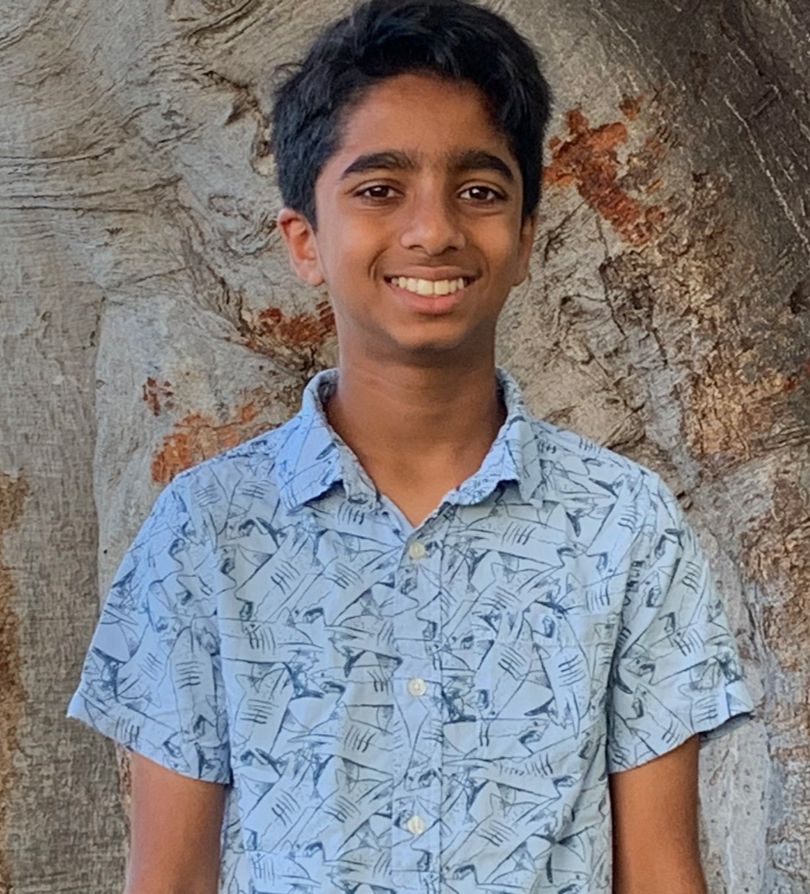

Hello, my name is Aaditya Taleppady.

I was born in San Diego, California. I am 15 years old, and am a 10th grader at Del Norte High School. My favorite subject in school is AP Calculus and AP Computer Science Principles. Some of my hobbies include coding, cooking, reading, and playing sports such as basketball and football.

Basketball:

- I love playing basketball in my free time. I also love watching basketball. My favorite basketball team is the Golden State Warriors.

Football:

- I also love playing football, but only for fun. I also love watching football. My favorite football team is the San Francisco 49ers.

These pictures represent the places I've visited:

India:

Hawaii:

Aruba:

These pictures represent my hobbies and interests:

 

    
1 / 4

    
    
Basketball

    
2 / 4

    
    
Coding

    
3 / 4

    
    
Cooking

    
4 / 4

    
    
Football

<!-- Next and previous buttons -->
<a class="prev" onclick="plusSlides(-1)">&#10094;</a>
<a class="next" onclick="plusSlides(1)">&#10095;</a>

 

<!-- The dots/circles -->

     
     
    
     

